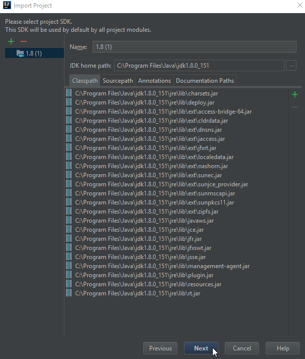
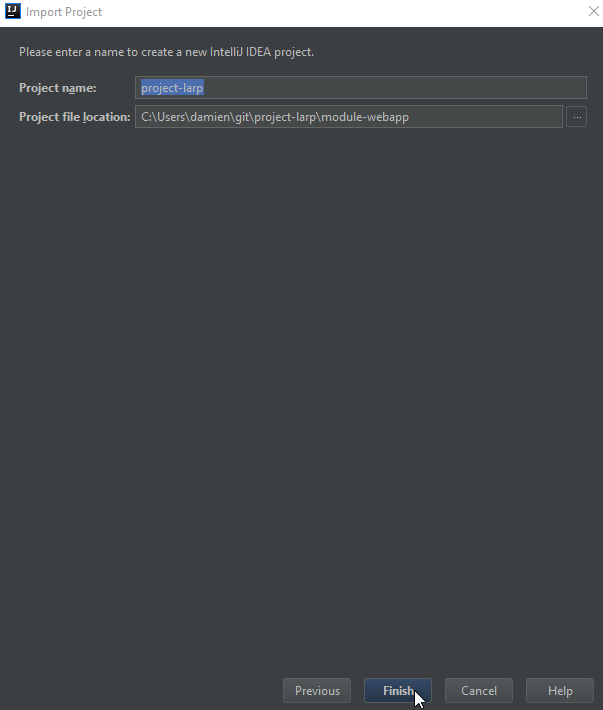
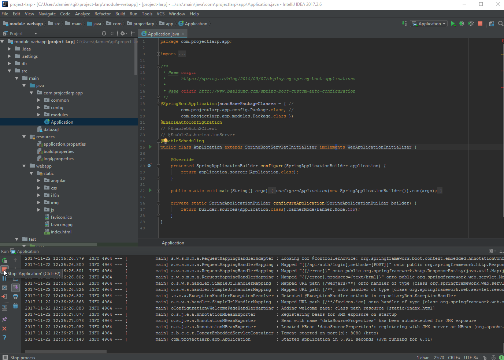
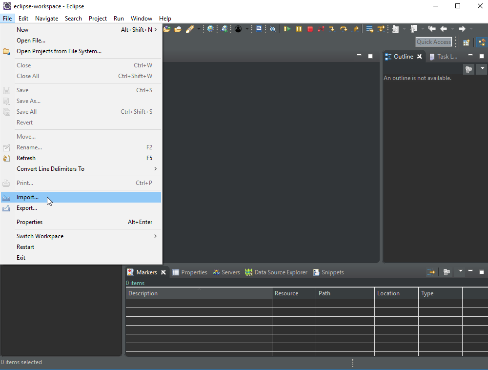
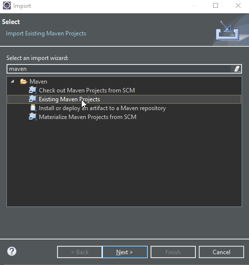
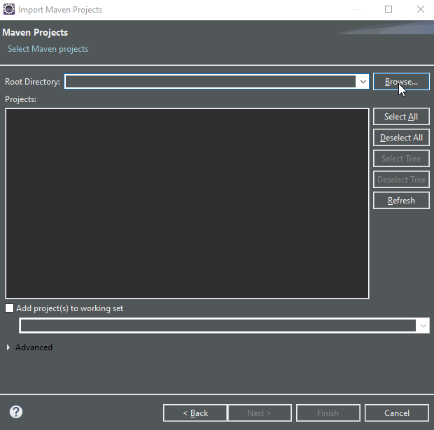
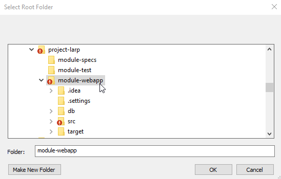

Project LARP - Developer Section
=============

!!! WORK IN PROGRESS !!!

Dev project page / URL : https://github.com/ProjectLarpOrg/project-larp

## Contents

* [Getting started](#getting-started)
* [Conventions](#conventions)
* [Learn](#learn)
* More...
  * [GitHub](#github)
  * [Java JDK 8](#java)
  * [IntelliJ IDEA](#intellij)
  * [Eclipse IDE](#eclipse)
  * [Debug](#debug)
  * [Software Design](#software-design)
  * [Software Development](#software-development)
---

## Getting started

* Get the project :
    * Register to [GitHub](https://github.com/)
    * Install [GitHub Desktop App](https://desktop.github.com)
    * Clone the project (URL at the top of this page) ([more...](#github))

* Run the app :
    * Install [Java JDK 8](http://www.oracle.com/technetwork/java/javase/downloads/jdk8-downloads-2133151.html) : download and install the latest ([more...](#java))
    * Choose an IDE/Editor and Run it:
        * [IntelliJ IDEA Community Edition](https://www.jetbrains.com/idea/) ([more...](#intellij))
        * or
        * [Eclipse IDE for JavaEE](https://www.eclipse.org/downloads/eclipse-packages/) ([more...](#eclipse))

* Test it :
    * open your [browser](https://www.google.com/chrome/) at [http://localhost:8080/](http://localhost:8080/)

* Debug :
    * Use Chrome Web tools ([more...](#debug))

---

## Conventions

### *Coding best practices.*

* Use JavaScript for scripts
* Use CSS for styles
* Use HTML for templates
* Use Java for 

A complete stack for Javascript, comprised of MongoDB, Express, Angular, and Node.

---

## Learn

Learn more about :

* Software Design ([more...](#software-design))
* Software Development ([more...](#software-development))
* Quality and Test ([more...]())
* Languages : [HTML](http://www.w3schools.com/html/), [CSS](http://www.w3schools.com/css/), [JavaScript](http://www.w3schools.com/js/), [Java](http://www.learnjavaonline.org/)
* Frameworks: [AngularJs](https://docs.angularjs.org/guide), [SpringBoot](https://docs.spring.io/spring-boot/docs/1.5.9.BUILD-SNAPSHOT/reference/htmlsingle/)

---

### GitHub

Get the project with GitHub

### Steps :
  * Create an account on GitHub if necessary
  * Download the desktop app
  * Open project page
  * Click on 'Clone in Desktop' button
  * Confirm 'launch application' popup
    * ...then GitHub app launch on your desktop
    * ...and wait for it to finish project download
  * The project must be in your <user folder>/Documents/GitHub/project-myrpgonline

---

### Java 

Install Java JDK 8

!!! WORK IN PROGRESS !!!

---

### IntelliJ

Getting started with IntelliJ IDEA

* first you need to install JDK 8

---

### Eclipse

Getting started with Eclipse IDE

* first you need to install JDK 8

---

### Debug

#### Chrome Developer Tools

press F12

Console

Inspect HTML

Network HTTP (REST, img, html)

Debug JavaScript

#### Chrome Extension

download from Chrome Web Store

Chrome angularjs ext

Advanced rest client 

---

### Software Design

---

### Software Development

## UI

#### Angular Material

* demo: https://material.angularjs.org/latest/demo/
* buttons: https://material.angularjs.org/latest/CSS/button
* grid: https://material.angularjs.org/latest/layout/grid
* directives: https://material.angularjs.org/latest/api/directive/mdTooltip
* icons demo (google) https://klarsys.github.io/angular-material-icons/
* icons demo mdi (community) https://materialdesignicons.com/
* icons sets https://github.com/nkoterba/material-design-iconsets

### MVC

#### AngularJS

* demo: https://angularjs.org/
* tuto: https://docs.angularjs.org/tutorial/step_01
* doc: https://docs.angularjs.org/guide

modules
* storage: https://github.com/gsklee/ngStorage
* websocket (chat): https://github.com/socketio/socket.io-client

blog:
* http://damienfremont.com/2015/10/13/javaee-angularjs-bootstrap-integration/
* http://damienfremont.com/2015/10/15/javaee-angularjs-bootstrap-routes-templates-redirection-and-params/
* http://damienfremont.com/2015/10/16/javaee-angularjs-bootstrap-form-basic-read-post/
* http://damienfremont.com/2015/10/17/javaee-angularjs-bootstrap-form-bean-validation-front-and-back/
* http://damienfremont.com/2015/10/17/javaee-angularjs-bootstrap-date-picker/
* http://damienfremont.com/2015/10/19/javaee-angularjs-bootstrap-file-upload/
* http://damienfremont.com/2015/10/20/javaee-angularjs-bootstrap-datatable-and-excel-export/
* http://damienfremont.com/2015/10/31/javaee-angularjs-bootstrap-how-to-filtering/
* http://damienfremont.com/2015/11/02/javaee-angularjs-bootstrap-how-to-pagination-with-smart-table/
* http://damienfremont.com/2015/11/03/javaee-angularjs-bootstrap-how-to-sort-with-smart-table/
* http://damienfremont.com/2015/11/04/javaee-angularjs-bootstrap-how-to-infinite-scroll/
* http://damienfremont.com/2015/11/05/javaee-angularjs-bootstrap-how-to-breadcrumb-and-navbar/
* http://damienfremont.com/2015/11/06/javaee-angularjs-bootstrap-how-to-multilingual-i18n-l10n/
* http://damienfremont.com/2015/11/08/javaee-angularjs-bootstrap-howto-charts-with-d3js/
* http://damienfremont.com/2015/11/19/javaee-angularjs-bootstrap-how-to-authent-basic/