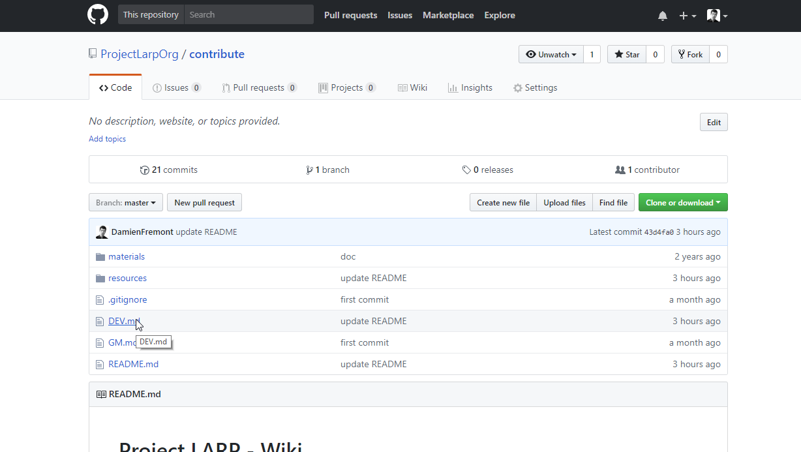
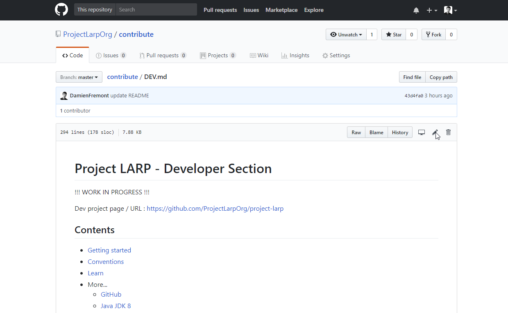
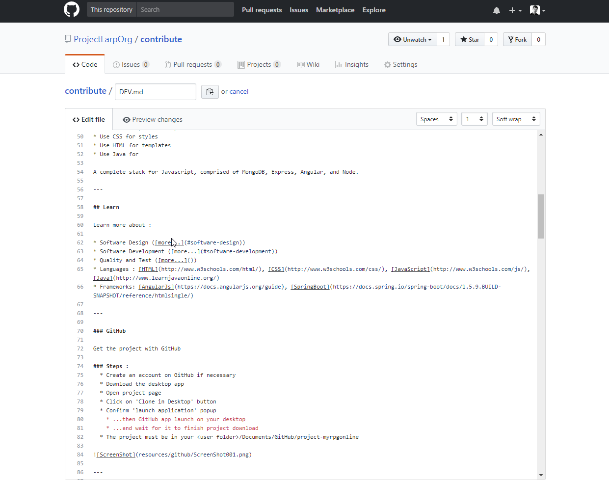
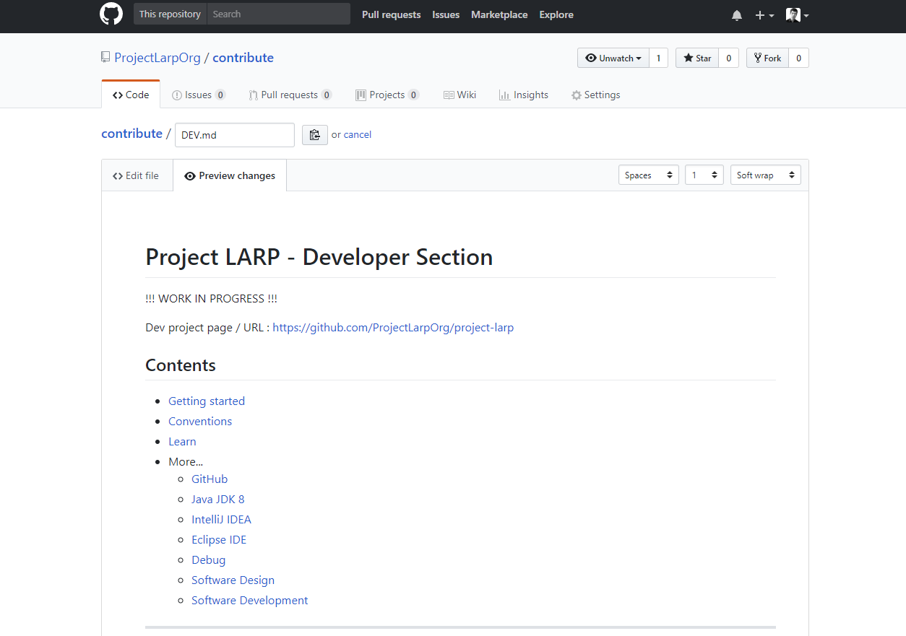
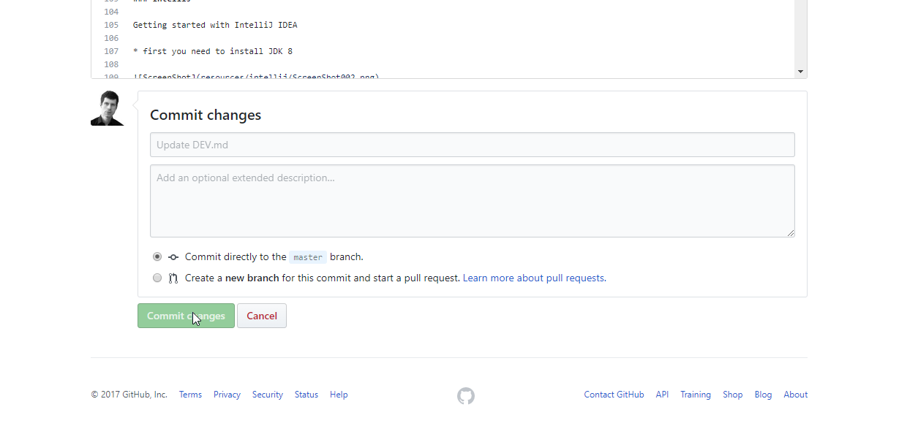
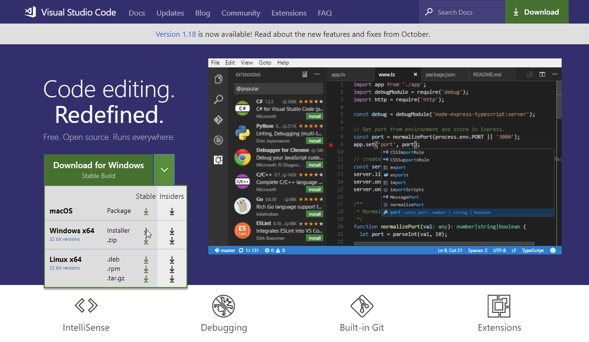
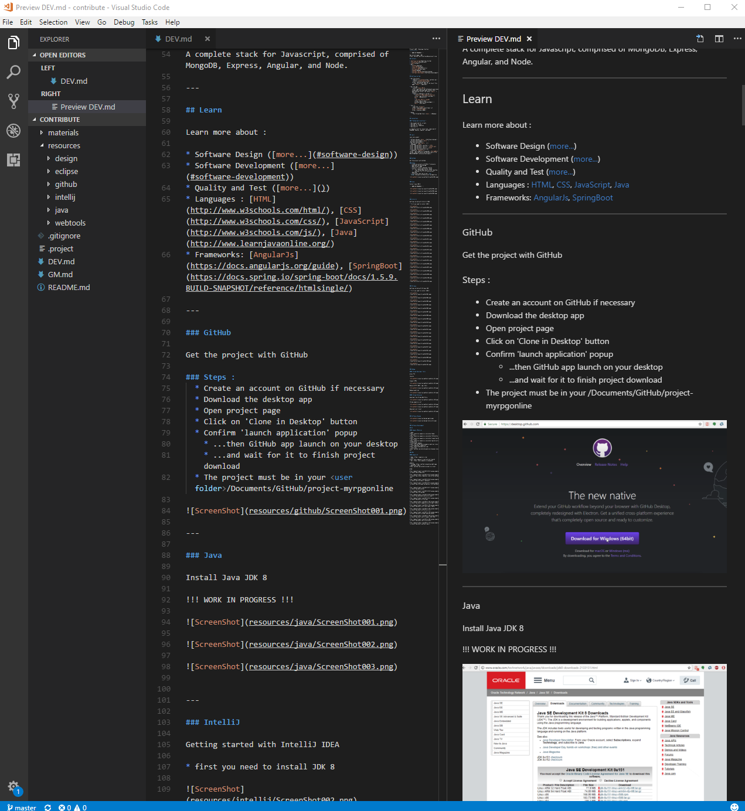

Project LARP - Gamemaster Section
=============

!!! WORK IN PROGRESS !!!

Dev project page / URL : https://github.com/ProjectLarpOrg/project-larp

## Contents

* [Getting started](#getting-started)
* [Contribute](#contribute)
* [Conventions](#conventions)
* More...
    * [Edit Specs](#edit-specs)
        * *Coming soon...*
    * [Edit Docs](#edit-docs)
        * [GitHub Readme](#github-readme) (remote/online)
        * or
        * [VisualStudioCode Readme](#visualstudiocode-readme) (local/desktop)

---

## Getting started

* Get the project :
    * Register to [GitHub](https://github.com/)
    * Install [GitHub Desktop App](https://desktop.github.com)
    * Clone the project (URL at the top of this page) ([more...](#github))

---

## Contribute

As a GameMaster user, you can:
* contribute to ideas on the [project's board on Trello](https://trello.com/b/9mDrJVpG/project-larp-roadmap)
* contribute to specs/features

---

### Edit Specs

---

### Edit Docs

Please read the official [Markdown Github guide](https://guides.github.com/features/mastering-markdown/) (the language used to write this doc).

### GitHub Readme

### VisualStudioCode Readme

