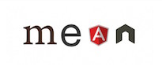
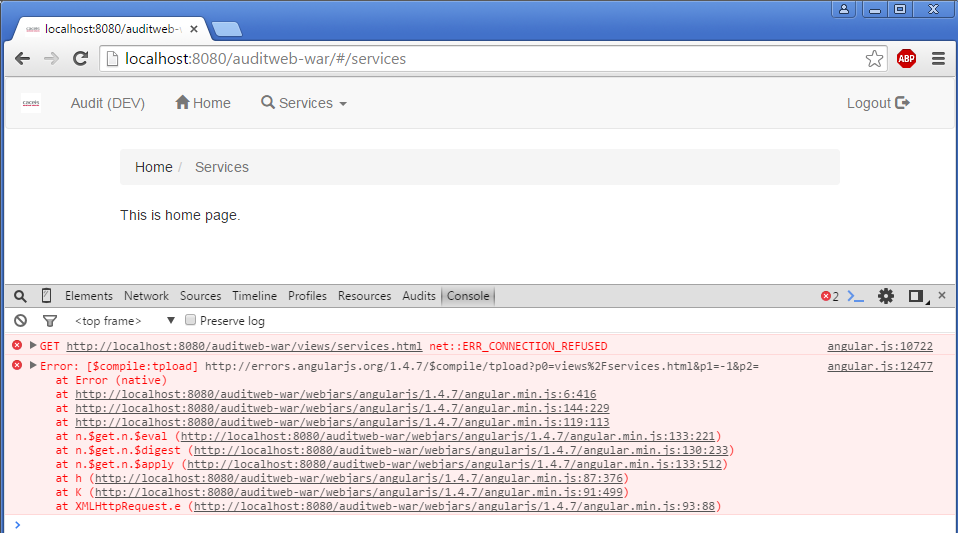
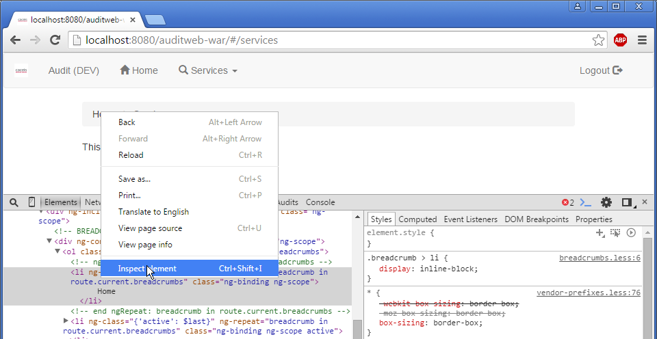
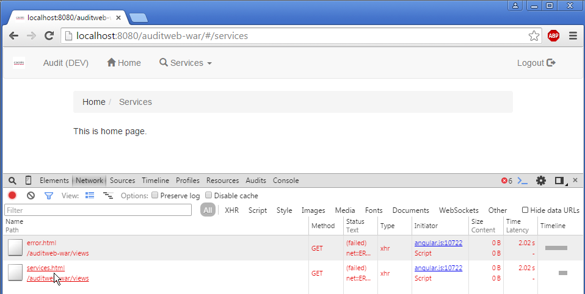
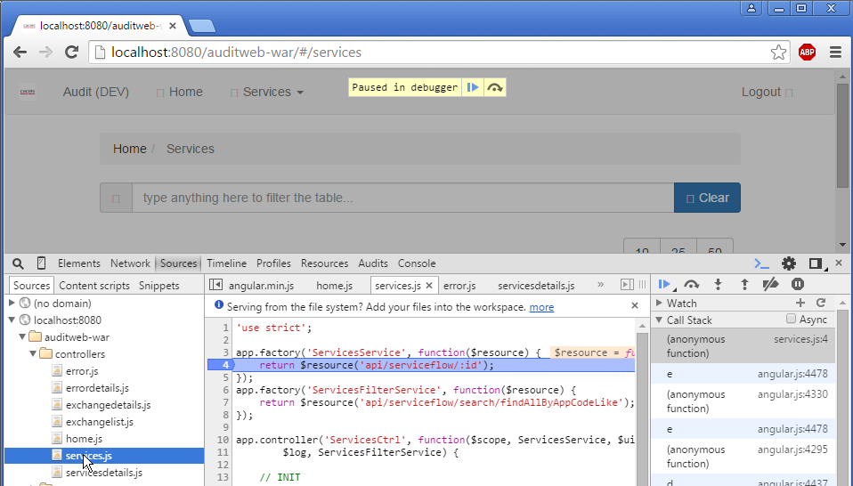
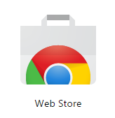
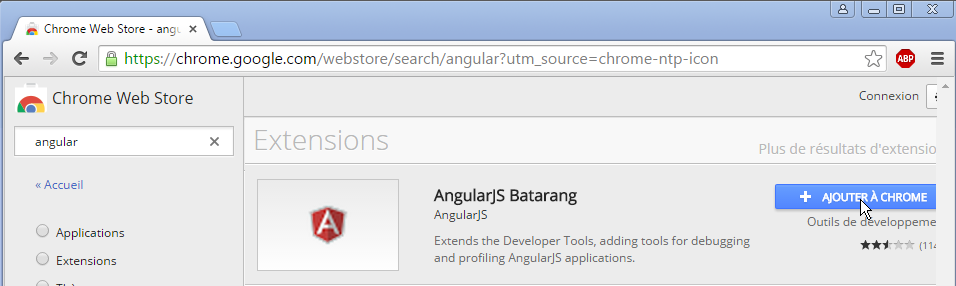
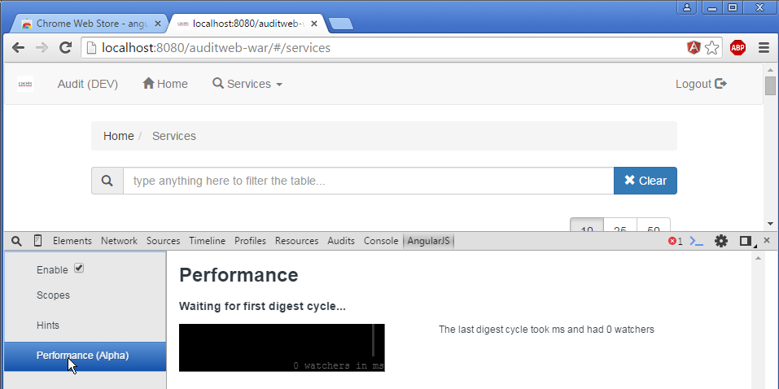
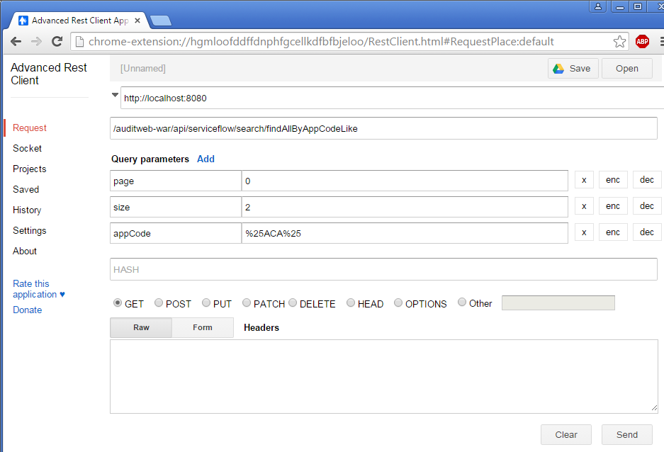

Project - Dev Wiki
=============

This Wiki is about learning to contribute to MRO Project. MRO is a web-based video game providing ways to implements role playing games (dungeon and dragons like) and playing it over the internet (web, mobile or desktop). It's targeting at Game Masters, Players and Casual Players.

## Contents

* [Reminder](#reminder)
* [Contribution](#contribution)
* [Getting started](#getting-started)
* [Conventions](#conventions)
* [Learn](#learn)

## Reminder

Tools
* Backlog (Trello) at https://trello.com/b/vMsZjqS1/
* Source (GitHub) at https://github.com/MRO-Org/
* Host (Heroku) at https://dashboard.heroku.com/apps

Projects
* Game
    * Source at https://github.com/MRO-Org/mro
    * Run at https://project-myrpgonline.herokuapp.com/play
* WebSite 
    * Source at https://github.com/MRO-Org/mro-website
    * Run at https://project-myrpgonline.herokuapp.com/

## Contribution

How to contribute ?

You can contribute by :
* testing the project at https://project-myrpgonline.herokuapp.com/
* participating to the project code base. First read the Getting Started page. After that, you can play with the project, then push some code.

## Getting started

* Install (if you don't have them):
    * [GitHub](https://desktop.github.com): download and install the latest
    * [SublimeText](http://www.sublimetext.com): download and install
    * [Node.js](http://nodejs.org): download and install
    * [Git](https://git-scm.com/download/win): download and install the latest
        * WARNING: choose 'Use Git from the Windows Command Prompt' during install
    * [Brunch](http://brunch.io): `npm install -g brunch@1.8.5` from command line (WIN+R,'cmd')
    * [Bower](http://bower.io): `npm install -g bower@1.6.4` from command line (WIN+R,'cmd')
* Get the project
    * Create an account on GitHub if necessary
    * Open project page https://github.com/DamienFremont/project-myrpgonline
    * Click on 'Clone in Desktop' button
    * Confirm 'launch application' popup
    * ...then GitHub app launch on your desktop
    * ...and wait for it to finish project download
    * The project must be in your <user folder>/Documents/GitHub/project-myrpgonline
* Run:
    * got to project scripts folder
    * click on install-1.bat then click on install-2.bat (only the first time, closed it manualy when it's finished)
    * click on start-1-client.bat and start-2-server.bat
        * a command line console window pop in
        * ...wait until the console displays 'started'
* Test:
    * open your browser at [http://localhost:3333/](http://localhost:3333/)
* Learn:
    * `public/` dir is fully auto-generated and served by HTTP server.  Write your code in `app/` dir.
    * Place static files you want to be copied from `app/assets/` to `public/`.
    * Languages: [HTML](http://www.w3schools.com/html/), [CSS](http://www.w3schools.com/css/), [JavaScript](http://www.w3schools.com/js/)
    * Frameworks: [AngularJs doc](https://docs.angularjs.org/guide), [Bootstrap doc](http://getbootstrap.com/getting-started/#examples), [Express.js doc](http://expressjs.com/guide/routing.html)
    * Tools: [Brunch site](http://brunch.io), [Node.js doc](http://www.tutorialspoint.com/nodejs/)

## Conventions
### *Coding best practices.*

* Use JavaScript for scripts
* Use CSS for styles
* Use HTML for templates

A complete stack for Javascript, comprised of MongoDB, Express, Angular, and Node.

The MEAN stack is a potent new concoction of javascript-flavored tooling, services, and frameworks that make modern, single-page application design a breeze:

* Use Brunch for build
* Use NodeJs for Server

## Learn

### UI:

#### Angular Material
* demo: https://material.angularjs.org/latest/demo/
* buttons: https://material.angularjs.org/latest/CSS/button
* grid: https://material.angularjs.org/latest/layout/grid
* directives: https://material.angularjs.org/latest/api/directive/mdTooltip

#### Material Design Lite
* demo: http://www.getmdl.io/components/index.html

#### Bootstrap
* demo: http://getbootstrap.com/getting-started/#examples
* doc Layout: http://getbootstrap.com/css/
* doc component:  http://getbootstrap.com/components/
* doc dynamic compon ent: https://angular-ui.github.io/bootstrap/

### MVC:

#### AngularJS
* demo: https://angularjs.org/
* tuto: https://docs.angularjs.org/tutorial/step_01
* doc: https://docs.angularjs.org/guide

modules:
* bootstrap integration: https://angular-ui.github.io/bootstrap/
* datetime picker: http://dalelotts.github.io/angular-bootstrap-datetimepicker/
    * d3js integration:
    * demo https://cmaurer.github.io/angularjs-nvd3-directives/
    * source https://github.com/angularjs-nvd3-directives/angularjs-nvd3-directives
* formatting https://github.com/mbostock/d3/wiki/Time-Formatting
* table integration: http://lorenzofox3.github.io/smart-table-website/
* language integration: https://angular-translate.github.io/

blog:
* http://damienfremont.com/2015/10/13/javaee-angularjs-bootstrap-integration/
* http://damienfremont.com/2015/10/15/javaee-angularjs-bootstrap-routes-templates-redirection-and-params/
* http://damienfremont.com/2015/10/16/javaee-angularjs-bootstrap-form-basic-read-post/
* http://damienfremont.com/2015/10/17/javaee-angularjs-bootstrap-form-bean-validation-front-and-back/
* http://damienfremont.com/2015/10/17/javaee-angularjs-bootstrap-date-picker/
* http://damienfremont.com/2015/10/19/javaee-angularjs-bootstrap-file-upload/
* http://damienfremont.com/2015/10/20/javaee-angularjs-bootstrap-datatable-and-excel-export/
* http://damienfremont.com/2015/10/31/javaee-angularjs-bootstrap-how-to-filtering/
* http://damienfremont.com/2015/11/02/javaee-angularjs-bootstrap-how-to-pagination-with-smart-table/
* http://damienfremont.com/2015/11/03/javaee-angularjs-bootstrap-how-to-sort-with-smart-table/
* http://damienfremont.com/2015/11/04/javaee-angularjs-bootstrap-how-to-infinite-scroll/
* http://damienfremont.com/2015/11/05/javaee-angularjs-bootstrap-how-to-breadcrumb-and-navbar/
* http://damienfremont.com/2015/11/06/javaee-angularjs-bootstrap-how-to-multilingual-i18n-l10n/
* http://damienfremont.com/2015/11/08/javaee-angularjs-bootstrap-howto-charts-with-d3js/
* http://damienfremont.com/2015/11/19/javaee-angularjs-bootstrap-how-to-authent-basic/

### SERVER:

#### ExpressJs
* tuto: http://expressjs.com/guide/routing.html

### TOOLS:

#### Chrome Developer Tools
press F12

Console

Inspect HTML

Network HTTP (REST, img, html)

Debug JavaScript

#### Chrome Extension

download from Chrome Web Store

Chrome angularjs ext

Advanced rest client 

