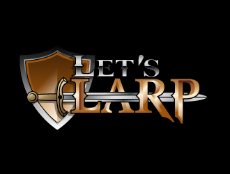

Project LARP
=============

!!! WORK IN PROGRESS !!!

This Wiki is about learning to contribute to LARP Project. LARP is a web-based tool providing ways to implements 
[Live action role-playing game](https://en.wikipedia.org/wiki/Gamemaster) 
and administrating it over the internet (web, mobile or desktop). It's targeting at [Gamemasters](https://en.wikipedia.org/wiki/Gamemaster) and Players.

## Documentation

* Developer ? [click here to see dev section...](./DEV.md)
* Gamemaster ? [click here gm section...](./GM.md)

---

## License

This software is provided free of charge and without restriction.

## Demo
A live [demo](http://projectlarp.servegame.com/dev/).

## How to contribute ?

You can contribute by :
* testing the project [online](http://projectlarp.servegame.com/dev/)
* participating to the project code base. First read the Getting Started page. After that, you can play with the project, then push some code.

---

## Links

* Trello
    * [Roadmap](https://trello.com/b/9mDrJVpG/)
    * [Backlog](https://trello.com/b/b3FmZMCj/)
* GitHub
    * [Wiki](https://github.com/Project-LARP-Org/contribute)
    * [Source](https://github.com/Project-LARP-Org/project-larp)
    * Website (soon...)
* Tomcat
    * [Host (dev)](http://projectlarp.servegame.com/dev/)

